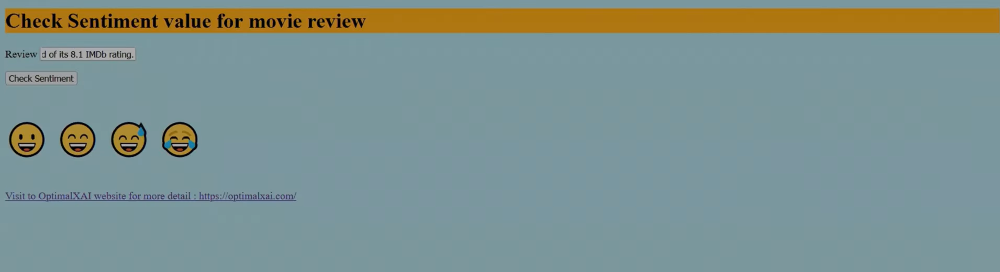
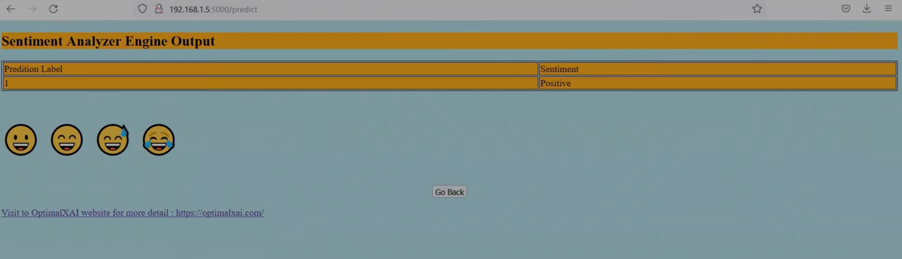

---

# 📊 Sentiment Analyzer WebApp

A **Machine Learning** and **Natural Language Processing (NLP)** project for sentiment analysis of movie reviews.  
This Project demonstrates building, training, and deploying sentiment analysis models using the **IMDB Movie Review Dataset (50K reviews)**.


---

## 📂 Project Overview

- **Goal:** Classify movie reviews as **positive** or **negative**.  
- **Dataset:** IMDB Movie Review Dataset (50,000 labeled reviews).  
- **Approach:**  
  - End‑to‑end NLP pipeline from **data preprocessing** → **feature engineering** → **model training** → **deployment**.  
  - Applied text preprocessing (tokenization, stopword removal, stemming/lemmatization).  
  - Feature extraction using **TF‑IDF** and **word embeddings**.  
  - Trained multiple models: **Logistic Regression**, **LSTM**, and **BERT**.  
  - Achieved high accuracy with reproducible experiments.  
  - Deployed locally with **Flask API** for serving predictions.  
  - Visualized performance metrics for model evaluation.

---

## ⚙️ Installation

Clone the repository and install dependencies:

```bash
git clone https://github.com/Hovering-Ace/sentimentanalysis.git
cd sentimentanalysis
pip install -r requirements.txt
```

---

## 🚀 Usage

Navigate to the `/sentimentanalysis` directory.

### 1. Train the Sentiment Analyzer Model
```bash
python main.py
```

### 2. Run the Flask API (Productionize the Model)
```bash
python SentimentAnalyzerEngine.py
```

The API will start on your local server, allowing you to send requests and test sentiment predictions.

---

## 🧪 Features

- **Custom NLP pipeline** built from scratch.  
- **Multiple ML & DL models** tested and compared.  
- **Reproducible experiments** with clear workflow.  
- **Local deployment** with Flask for real‑time inference.  
- **Performance visualization** for model evaluation.  

---

## 🤝 Contributing

Pull requests are welcome!  
For major changes, please open an issue first to discuss what you’d like to change.  
Ensure that tests are updated as appropriate.

---

## 📜 License

This project is licensed under the [Apache 2.0 License](https://choosealicense.com/licenses/apache-2.0/).

---

### ✨ Summary
This project showcases a **complete sentiment analysis pipeline**: from raw text preprocessing to advanced deep learning models, ending with a deployable API. It’s a practical case study for anyone learning NLP, ML model deployment, or reproducible ML workflows.

---

### 🖼️ User Interface
The project includes a simple Flask‑based UI for testing sentiment predictions interactively.
- Home Page: Input a movie review text.
  

- Prediction Result: Displays whether the sentiment is Positive or Negative.
   


