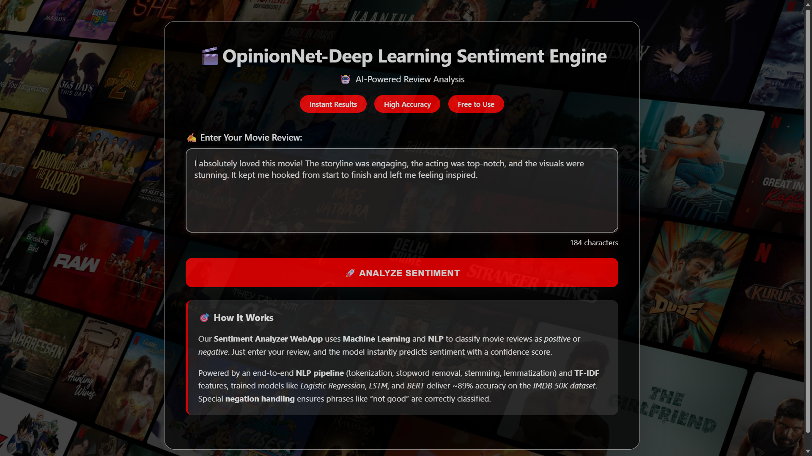
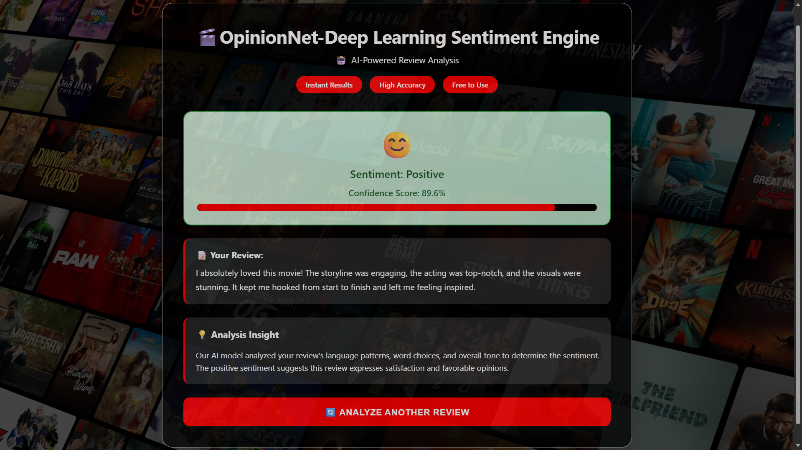

---

📊 OpinionNet-Deep Learning Sentiment Analysis Engine

A **Machine Learning** and **Natural Language Processing (NLP)** project for sentiment analysis of movie reviews.  
This Project demonstrates building, training, and deploying sentiment analysis models using the **IMDB Movie Review Dataset (50K reviews)**.


---

## 📂 Project Overview

- **Goal:** Classify movie reviews as **positive** or **negative**.  
- **Dataset:** IMDB Movie Review Dataset (50,000 labeled reviews).  
- **Approach:**  
  - End‑to‑end NLP pipeline from **data preprocessing** → **feature engineering** → **model training** → **deployment**.  
  - Applied text preprocessing (tokenization, stopword removal, stemming/lemmatization).  
  - Feature extraction using **TF‑IDF** and **word embeddings**.  
  - Trained multiple models: **Logistic Regression**, **LSTM**, and **BERT**.  
  - Achieved high accuracy with reproducible experiments.  
  - Deployed locally with **Flask API** for serving predictions.  
  - Visualized performance metrics for model evaluation.

---


---
### Web Interface

1. **Main Sentiment Analysis Page** (`http://127.0.0.1:5000`):
   - Enter any text (movie review, product feedback, etc.) in the text area
   - Click "Analyze Sentiment" to get instant results
   - View the predicted sentiment (Positive/Negative) with confidence percentage
   - See the original text displayed for reference

2. **Analytics Dashboard** (`http://127.0.0.1:5000/analytics`):
   - View overall dataset statistics (total reviews, positive/negative counts)
   - Interactive bar chart showing sentiment distribution
   - Navigate back to the main analysis page

### What It Provides

- **Instant Sentiment Analysis**: Real-time prediction of text sentiment with probability scores
- **Educational Tool**: Learn about natural language processing and machine learning through a practical web application
- **Data Insights**: Understand sentiment patterns in text data through the analytics dashboard
- **Negation-Aware Processing**: Accurately handles complex language constructs like negations
- **High Accuracy**: 89% accuracy model trained on large IMDB dataset for reliable predictions
- **Web-Based Accessibility**: No installation required for end-users, accessible via any web browser

### Example Usage

- **Movie Reviews**: "This film was absolutely fantastic!" → Positive (95% confidence)
- **Product Feedback**: "The product works well but not great." → Negative (78% confidence)
- **Social Media**: "Not disappointed with the service." → Positive (82% confidence)

### Prerequisites
- Python 3.8 or higher
- Git (optional, for cloning)

### Quick Start

1. **Clone or navigate to the project directory**
   ```bash
     git clone https://github.com/Hovering-Ace/sentimentanalysis.git
     cd sentimentanalysis
    ```

2. **Create a virtual environment**
   ```powershell
   python -m venv .venv
   .venv\Scripts\Activate.ps1
   ```

3. **Install dependencies**
   ```powershell
   pip install --upgrade pip
   pip install -r requirements.txt
   ```

4. **Run the application**
   ```powershell
   python app.py
   ```

5. **Open your browser**
   - Main app: http://127.0.0.1:5000
   - Analytics: http://127.0.0.1:5000/analytics


The API will start on your local server, allowing you to send requests and test sentiment predictions.

---

## 🧪 Features

- **Custom NLP pipeline** built from scratch.  
- **Multiple ML & DL models** tested and compared.  
- **Reproducible experiments** with clear workflow.  
- **Local deployment** with Flask for real‑time inference.  
- **Performance visualization** for model evaluation.  

---

## 🤝 Contributing

Pull requests are welcome!  
For major changes, please open an issue first to discuss what you’d like to change.  
Ensure that tests are updated as appropriate.

---

## 📜 License

This project is licensed under the [Apache 2.0 License](https://choosealicense.com/licenses/apache-2.0/).

---

### ✨ Summary
This project showcases a **complete sentiment analysis pipeline**: from raw text preprocessing to advanced deep learning models, ending with a deployable API. It’s a practical case study for anyone learning NLP, ML model deployment, or reproducible ML workflows.

---

### 🖼️ User Interface
The project includes a simple Flask‑based UI for testing sentiment predictions interactively.
- Home Page: Input a movie review text.
  

# Prediction Result: Displays whether the sentiment is Positive or Negative.
   

# Prediction Result: Displays whether the sentiment is Positive or Negative.
   


